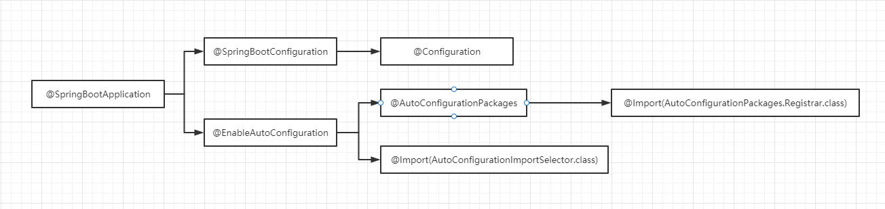

1. springboot 源码知识前置
2. springboot 注解编程的发展
3. springboot 自动装配原理
4. springboot 启动过程 -- run() 源码分析
5. springboot 属性文件加载的过程分析
6. springboot 监听机制
7. springboot 健康检查 actuator

请进入 spring-boot-debug 模块进行学习

1. run() 方法源码解析

